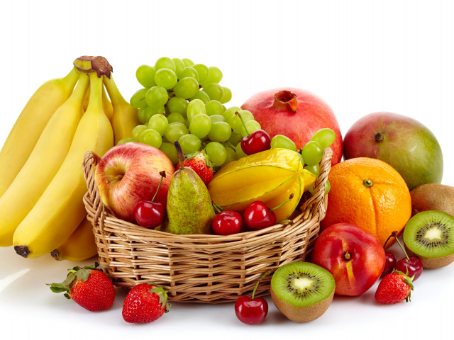

#### Git инструкция

## Виды текста

В Markdown несколько разных способов выделения текста.

Например, чтобы написать курсивом надо текст выделить звездочками - *вот так* или нижним подчеркиванием _вот так_

Чтобы написать текст полужирным шрифтом необходимо поставить **две звездочки** или __двойное подчеркивание__

Можно писать одновременно _курсивом и **полужирным текстом**_

## Списки

Списки можно сделать нумерованные и ненумерованные. Нумерованный список пишется с номером отдельно на каждой строке:
1. первое
2. второе
3. третье

Ненумерованные списки пишутся вместо числа (номер) знак +:
+ элемент 1
+ элемент 2

## Работа с изображениями

чтобы вставить изображение в текст надо подготовить файл с изображением, перенести его в папку репозитория и написать:

## Разное

Заголовки пишем через #. Если #### то получается заголовок четвертого уровня, если ## - то второго уровня и так далее

